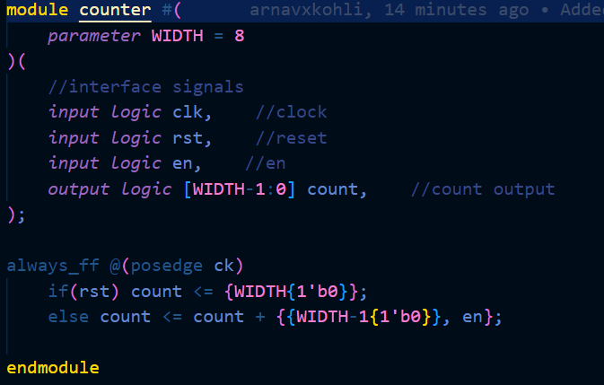
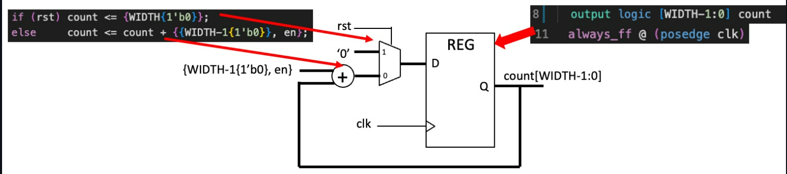
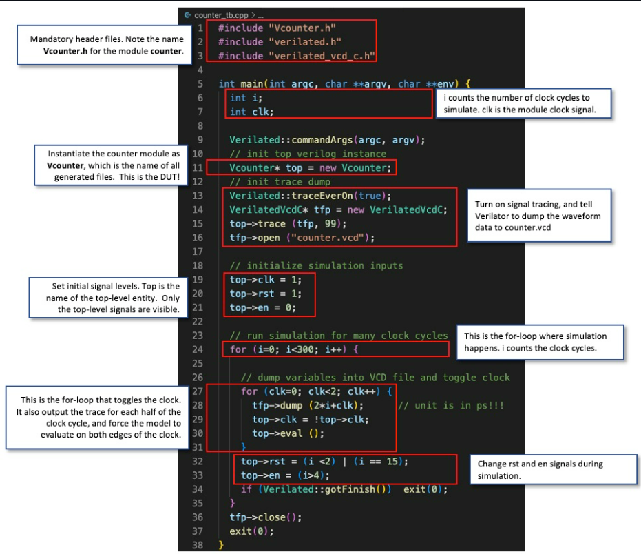

# Task 1

## Step 1: Create a folder tree on your local disk for this module.

This step involved forking the main repository from the website and forking it into my own. 

Steps followed:
- Forked the repository to [arnavxkohli/Lab1-Counter](https://github.com/arnavxkohli/Lab1-Counter).
- Cloned the repository to the path: **/Documents/iac** on my local system.

---

## Step 2: Run VS Code and open the Lab1-Counter folder.
  The next step was to open VS Code and find the **Task1** directory (where this readme is stored).

---
## Step 3: Create a new System Verilog file (counter.sv).
  After VS Code was opened in the directory for the task to be implemented, I created the file **counter.sv** which contains the synthesizable **System Verilog** code for the counter. The module **counter** implements the counter required for this task.   

  

  The code for the counter was implemented as shown by the module shown above.

  Some things to note are:
  - The **file name** and the **module name** are the same.
  - The number of bits in the counter is specified with the parameter **WIDTH**. It is currently set to 8-bit. This allows me to dynamically change the number of bits as needed and generate an **n-bit counter** as needed in the future.
  - The always_ff @ (posedge clk) is the way that one specifies a **clocked** circuit.
  - ‘<=’ in line 12 and 13 are non-block assignments which should be used within an always_ff block. Non blocking assignments ensure that the circuit is synthesized **parallelly** instead of **sequentially** (refer to notes for the reason).
  - **{WIDTH{1’b0}}** in line 12 uses the concatenation operator { } to form **WIDTH(8)** bits of ‘0’.
  - How it works is, the code ensures that the current value of the counter is updated to count + 0000000 + en where en is the **LSB**. Here, 1 is added to the existing value of count everytime en goes **high**. Until and unless en goes high, the count stays at the same value (unless reset is called).
  
  

---
## Step 4: Create the testbench file counter_tb.cpp in C++ using VS Code.
  This step involved creating the testbench file **counter_tb.cpp**(check file directory). The testbench works as a wrapper above the system verilog code for gtkwave and the subsequent simulation on **Vbuddy**.This testbench file is a template for all other testbench files. It consists of various sections, which are mandatory(except for the trace dump section in case waveforms aren't needed).

  

  The figure above explains the process of creating the test bench.

## Step 5: Compile the System Verilog model with the testbench.
  A shortcut to performing this step is writing a shell script which runs the required commands to create the vcd file as well as run it.

